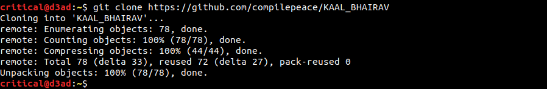
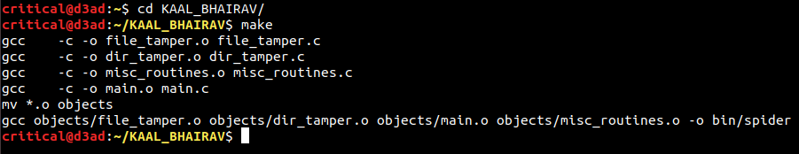
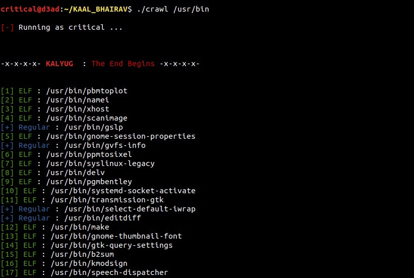

# KAAL BHAIRAV
Kaal Bhairav is a **terribly fearful form** of **lord shiva** (**The Destroyer** within the trimurti). Considering the analogy, the virus started on exploring the darker side of system programming on linux platform and ended up into a virus. The virus code parses the linux filesystem and infects every piece of binary it that falls through its sight.  
Halfway during my journey of implementing the virus code, I got to learn that the idea behind the infection was already published by **Silvio Cesare** as the *first ELF virus for UNIX platforms* in October 1998. So, the technique here is not any creation but my own implementation which uses *TEXT Segment padding* to perform parasitic code infection on the host binary which is based upon **Silvio Cesare's segment padded trojan**. Since this is the my first implementation to an ELF virus, code is a bit buggy ;) 

## ALGORITHM
Bellow is a bird's eye view of 2 algorithms that I implemented while writing kaal bhairav. Details on the algorithms can be found in [elf.c] (first approach) and [evil_elf.c] (second approach).
  
### FIRST APPROACH

1. Patch the e_shoff ( Section Header Table offset in ELF header) (increase by a PAGE_SIZE)

2. Load Parasite into memory and -
    * Patch parasite jmp-on-exit address with value of e_entry (host entry point)

3. Find CODE Segment and increase the bellow by a PAGE_SIZE -
    * p_filesz
    * p_memsz 

4. For all segments bellow CODE segment in Program Header Table, increase the bellow by a PAGE_SIZE
    * p_offset
    * p_vaddr
    * p_paddr

5. Find the last section in CODE Segment and increase the bellow by a PAGE_SIZE -
    * sh_size

6. For all section headers after the last section of CODE Segment, increase by a PAGE_SIZE -
    * sh_offset
    * sh_addr

7. Physically insert the parasite code at CODE segment's end & pad to the PAGE_SIZE -
    * @ parasite_address = p_offset + p_filesz (original)

8. Patch ELF Header's e_entry with parasite_address

  
### SECOND APPROACH
1. Load parasite from file into memory

2. Find padding size between CODE segment and the NEXT segment after CODE segment. Increase its -
    * p_filesz by parasite size)
    * p_memsz (by parasite size)

3. Patch host entry point.

4. Patch Section Header Table (SHT) : Find the last section in CODE Segment and increase -
    * sh_size   (To accomodate parasite)

5. Patch parasite offset. Find and replace parasite jmp-on-exit address with host entry point.

6. Inject Parasite @ host mapping

## BUILDING
To build the binary, follow the bellow steps ^_~

Now, building the binary !

Finally running the binary with a \<pathname> as parameter.

##  AIM
This project started out of curiosity so it doesn't encourage destruction (in any context) but is aimed at exploring the limits of system programming and developing a offensive approach towards systems and machines which may result into a better approach towards analysing and mitigating threat (albeit this is nowhere near to modern threat which leverages a lot more sophisticated techniques of spreading infection, maintaining persistence etc by obfuscation, encryption, polymorphism and what not). Therefore, no harm is intended by the project rather only learning is promoted.

**NOTE** - You wouldn't want to run the binary with root priveleges because any path you provide outside of your home directory may lead to corruption such that the system may end up being in an unstable state or may become entirely unsable. Also, righ now its not implemented to stop itself from corrupting its own directory so be careful with the path you provide as argument because if the path you provide is a parent or an ancestor just above Kaal bhairav, it may corrupt its own directory too !

## REFERENCES
Here are references to some of the resources I came accross and found out to be really helpful while writing the infection -
- [Unix Viruses Mailing List] by Silvio Cesare
- [Bitlackeys Research] by Ryan O'Neill A.K.A ElfMaster
- [The ELF Virus Writing HOWTO] by Alexander Bartolich
- [ELF Fun Injector] by 0x00pf pico

Cheers x_x

 

**NAME**  : Abhinav Thakur *(Mahakaal)*  
**EMAIL** : compilepeace@gmail.com  

[elf.c]: ./elf.c
[evil_elf.c]: ./evil_elf.c
[Unix Viruses Mailing List]: https://www.win.tue.nl/~aeb/linux/hh/virus/unix-viruses.txt
[Bitlackeys Research]: http://www.bitlackeys.org/#research
[The ELF Virus Writing HOWTO]: http://virus.bartolich.at/virus-writing-HOWTO/_html/index.html
[ELF Fun Injector]: https://0x00sec.org/t/elfun-file-injector/410