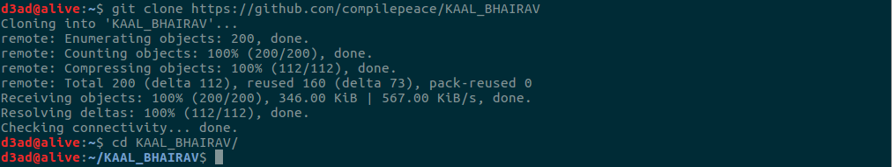
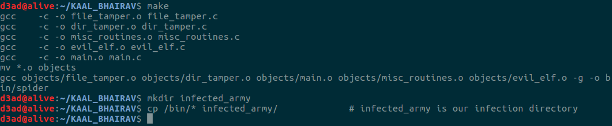
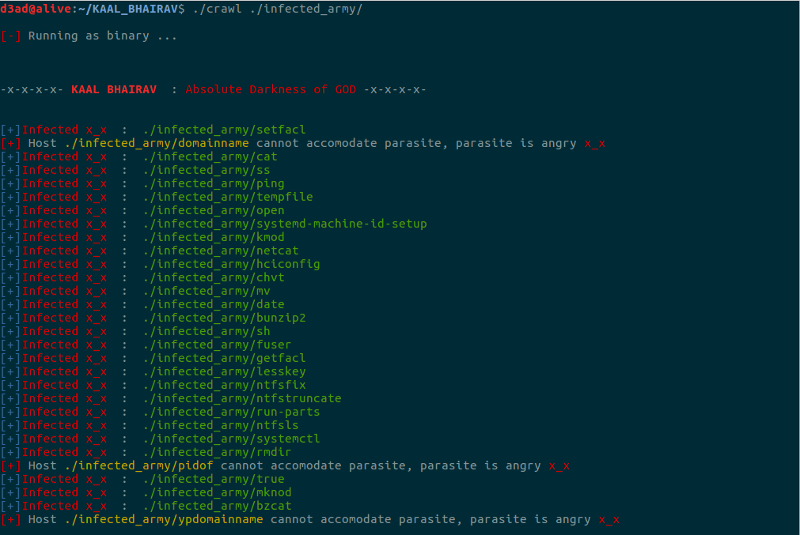
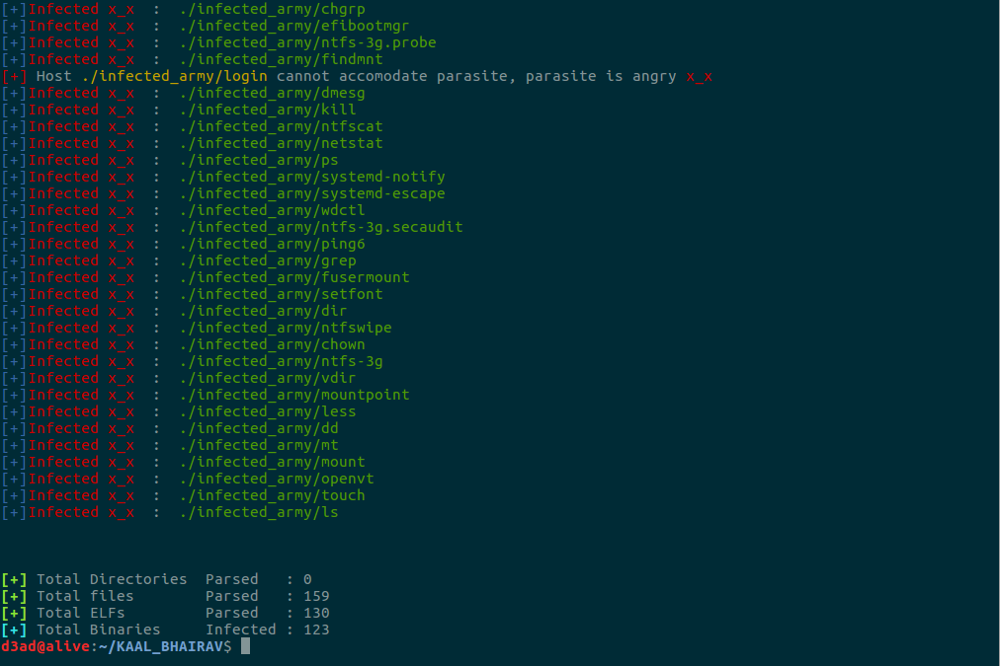
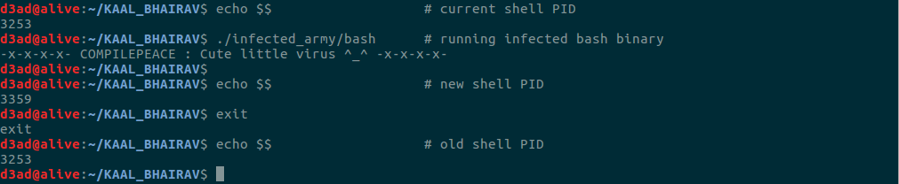

# KAAL BHAIRAV
Kaal Bhairav is a **terribly fearful form** of **lord shiva** (**The Destroyer** within the trimurti). Considering the analogy, the application code was started on exploring the darker side of system programming on linux platform and ended up into an *elf-infector*. The virus code parses the linux filesystem and stealthily infects every system utility/program that falls through its sight with a *parasite code* (not a good news for host system)  

Kaal Bhairav is based on technique similar to **Silvio Cesare's** segment padding trojan and infects both **EXECUTABLE(ET_EXEC)** and **SHARED OBJECT(ET_DYN)** binaries on *Linux file system*. There are few other infectors using *entry point modification* technique to infect binaries but they can no longer be used to stealthily infect binaries on modern linux distributions where almost all system utilities(*bash*, *cp*, *ls* to name a few) are compiled as shared objects (which uses offsets rather of absolute addresses). 

Since this is the my first implementation to an ELF virus, the infector might be a bit buggy ;)
 
##  AIM
This project is aimed at exploring the darker side of system programming and developing a offensive approach towards systems and machines which may result into a better understanding and approach towards analysing and mitigating threat (albeit this is nowhere near to modern threat which leverages a lot more sophisticated and more reliable techniques of spreading infection, maintaining persistence, avoiding detection etc by obfuscation, encryption, polymorphism and what not). Therefore, it doesn't promote destruction (in any context) rather only learning is promoted.

## LAYMAN's SOURCE CODE
1. Check if Kaal bhairav runs with Root privelege.
2. Open the directory (at the start, it will be the infection point/path provided by threat actor) and read the directory entries.
3. Identify the filetype and properties of each directory entry.
4. If the entry a regular file and store it in a linked-list.
5. If the entry is a directory, goto step 2
6. Destroy(): Parse the linked-list node-by-node(storing absolute pathname of each file to be processed) and identify elf binaries (by its magic number).
7. IfELF(), map the file into memory (mmap() with SHARED mapping) and start processing it with the infection algorithm.
8. If its any file other than ELF binary, do nothing (which could be replaced with a simple xor-encryption to scramble all files in File System)
9. Do this until all nodes are infected.

## INFECTION ALGORITHM
Bellow is a bird's eye view of 2 algorithms that I implemented while writing kaal bhairav. Details on the algorithms can be found in [elf.c] (first approach) and [evil_elf.c] (second approach).
  
### FIRST APPROACH (Extending the CODE segment)

1. Patch the e_shoff ( Section Header Table offset in ELF header) (increase by a PAGE_SIZE)

2. Load Parasite into memory and -
    * Patch parasite jmp-on-exit address with value of e_entry (host entry point)

3. Find CODE Segment and increase the bellow by a PAGE_SIZE -
    * p_filesz
    * p_memsz 

4. For all segments bellow CODE segment in Program Header Table, increase the bellow by a PAGE_SIZE
    * p_offset
    * p_vaddr
    * p_paddr

5. Find the last section in CODE Segment and increase the bellow by a PAGE_SIZE -
    * sh_size

6. For all section headers after the last section of CODE Segment, increase by a PAGE_SIZE -
    * sh_offset
    * sh_addr

7. Physically insert the parasite code at CODE segment's end & pad to the PAGE_SIZE -
    * @ parasite_address = p_offset + p_filesz (original)

8. Patch ELF Header's e_entry with parasite_address

  
### SECOND APPROACH (Injection into the padding - demonstrated bellow)
1. Load parasite from file into memory

2. Find padding size between CODE segment and the NEXT segment after CODE segment. Increase its -
    * p_filesz by parasite size)
    * p_memsz (by parasite size)

3. Patch host entry point.

4. Patch Section Header Table (SHT) : Find the last section in CODE Segment and increase -
    * sh_size   (To accomodate parasite)

5. Patch parasite offset. Find and replace parasite jmp-on-exit address with host entry point.

6. Inject Parasite @ host mapping

## TRY IT OUT !
First clone the repository and move into the directory -

Next, Build the binaries. I've made a testing environment (infected_army directory), albeit the whole File System is a playground.

Finally running the binary with a \<infection_directory_pathname> as parameter.

...

Let's have a look @ infected binaries, I choose to run bash !

The parasite code doesn't itself intend any kind malicious behaviour (just throws up a code with signature to all the binaries it infects as a proof of arbitrary code being executed before the intended behaviour of our beloved host binary) but noone can stop anyone from modifying the poison pill and achieve different kind of malicious behaviour which is relatively trivial (imagination is the only limit of Arbitrary Code Execution).

**NOTE** - You wouldn't want to run the binary with root priveleges because any path you provide outside of your home directory may lead to corruption such that the system may end up being in an unstable state or may become entirely unsable. Also, righ now its not implemented to stop itself from corrupting its own directory so be careful with the path you provide as argument because if the path you provide is a parent or an ancestor just above Kaal bhairav, it may corrupt its own directory too !

## REFERENCES
Here are references to some of the resources I came accross and found out to be really helpful while writing the infection -
- [Unix Viruses Mailing List] by Silvio Cesare
- [Bitlackeys Research] by Ryan O'Neill A.K.A ElfMaster
- [The ELF Virus Writing HOWTO] by Alexander Bartolich
- [ELF Fun Injector] by 0x00pf pico

Cheers x_x

 

**NAME**  : Abhinav Thakur *(Mahakaal)*  
**EMAIL** : compilepeace@gmail.com  

[elf.c]: ./elf.c
[evil_elf.c]: ./evil_elf.c
[Unix Viruses Mailing List]: https://www.win.tue.nl/~aeb/linux/hh/virus/unix-viruses.txt
[Bitlackeys Research]: http://www.bitlackeys.org/#research
[The ELF Virus Writing HOWTO]: http://virus.bartolich.at/virus-writing-HOWTO/_html/index.html
[ELF Fun Injector]: https://0x00sec.org/t/elfun-file-injector/410